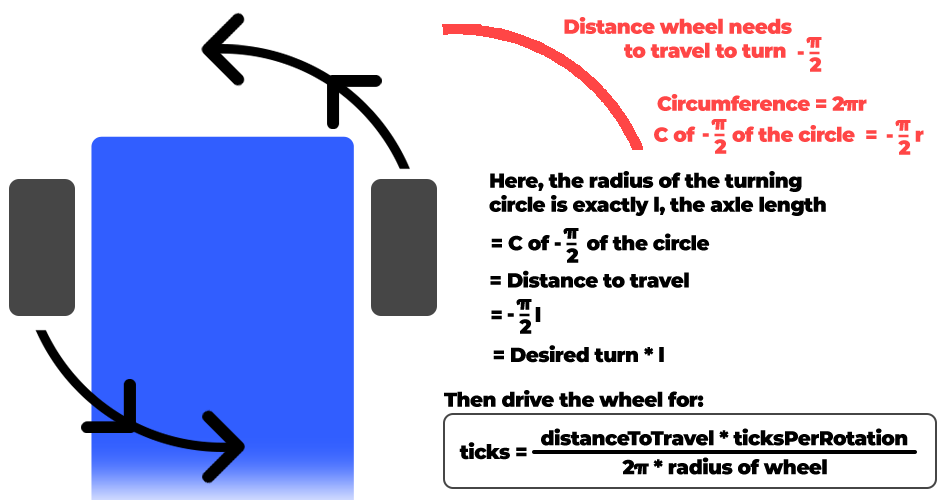
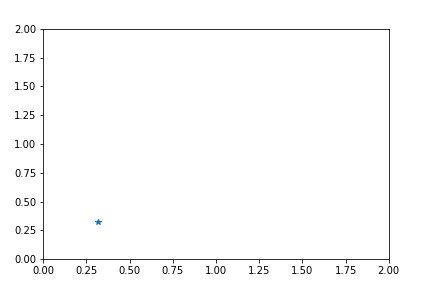

# Lab 2 Report

## TL;DR
Going forward in a straight line is difficult. Rotating is pretty hard too. Now lets put them together with LED lights and do a circle as well. This was a pretty great experiment and was super eye opening about the kinematics of robotics.


## Part 1
---
### Introduction to Publishers and Subscribers

<br>

Below you can see the screenshot to view the camera image in my custom topic using rqt_image_view.


<figcaption align = "center"><b>Fig.1: Diagram to find tick rotation</b></figcaption>

<u>ENTER IT HERE </u>

This was the code used to generate the custom topic to view the above image. Looking at it again, it's pretty trivial. However, doing it for the first time definitely took some searching and meddling around.

```python
#!/usr/bin/env python3

import os
import rospy
from duckietown.dtros import DTROS, NodeType
from std_msgs.msg import String

#found this by: running gui tools -> cmd 'rostopic list' -> find topic you want ->  'rostopic info [topic name]' 
#then import the files wanted
from sensor_msgs.msg import CompressedImage

class MyPublisherNode(DTROS):

    def __init__(self, node_name):
        # initialize the DTROS parent class
        super(MyPublisherNode, self).__init__(node_name=node_name, node_type=NodeType.GENERIC)
        
        # construct publisher string and publisher
        publisherString = "/" +  os.environ['VEHICLE_NAME'] + "/camera_node/image/compressed"
        self.pub = rospy.Publisher('chatter', String, queue_size=10)

    def run(self):
        #get the duckie bot name
        duckiebotname = os.environ['VEHICLE_NAME']
        # publish message every 1 second
        rate = rospy.Rate(10) # 1Hz
        while not rospy.is_shutdown():
            message = "Hello from " + duckiebotname
            rospy.loginfo("Publishing message: '%s'" % message)
            self.pub.publish(message)
            rate.sleep()

if __name__ == '__main__':
    # create the node
    node = MyPublisherNode(node_name='my_publisher_node')
    # run node
    node.run()
    # keep spinning
    rospy.spin()
```

<br>

**Question: What is the relation between your initial robot frame and world frame?** 

Before we can go into the relation between the two, lets make sure we know what each frame represents! The robot frame signifies the transformations and translations occurring to the robot *in relation to the robot.* The world frame represents the space the robot is operating in or moving through. As the robot moves, the coordinates for the robot and world frame are update accordingly. In our lab, [0,0,0] is the initial robot frame, and [0.32,0.32,0] is usually the launch point in the world frame. We can use the concepts of forward and inverse kinematics to find the relation between the two frames. 

In theory, this is no problem; however in practice, serious issues can occur. The encoders and motors used on the duckiebots are not ideal, however they are good for their purposes. When things like slippage or unforeseen ticking of the motor happens, these causes discrepancies in the distance calculations and therefore cause errors in the coordinate systems of the robot and world frame. 

Basically, dead reckoning = bad. (That's harsh. Let's say "could be *much* better 🚢)

<br>

**Question: How do we transform between the robot and world frame?**

Using this equation, we were able to convert between the robot and the world frame. (Please note the world frame may be denoted with subscript $W$ in remainder of this report):


$$\begin{equation}
\begin{bmatrix}
\dot{x_I} \\
\dot{y_I} \\
\dot{\theta_I}
\end{bmatrix}
= R(\theta)^{-1} = 
\begin{bmatrix}
\cos(\theta) & \sin(\theta) & 0 \\
-\sin(\theta) & \cos(\theta) & 0 \\
0 & 0 & 1
\end{bmatrix}
\begin{bmatrix}
\dot{x_R}\\
\dot{y_R}\\
\dot{\theta_R}
\end{bmatrix}
\end{equation}$$

Simplified, this turns into:
$$\begin{equation}
\dot{x_I} = \dot{x_R} \cos(\theta) - \dot{y_R} \sin(\theta) + \dot{\theta_R} \cdot 0
\end{equation}$$

$$\begin{equation}
\dot{y_I} = \dot{x_R} \sin(\theta) + \dot{y_R} \cos(\theta) + \dot{\theta_R} \cdot 0
\end{equation}$$

$$\begin{equation}
\dot{\theta_I} = \dot{x_R} \cdot 0 + \dot{y_R} \cdot 0 + \dot{\theta_R} \cdot 1
\end{equation}$$

Taking the following general equation: 

$$\begin{equation}
\begin{bmatrix}
\dot{x_R} \\
\dot{y_R} \\
\dot{\theta_R}
\end{bmatrix}
= 
\frac{1}{2}
\begin{bmatrix}
\frac{r\dot{\varphi_R} + r\dot{\varphi_L}}{2} \\
0 \\
\frac{r\dot{\varphi_R} - r\dot{\varphi_L}}{2l}
\end{bmatrix}
\end{equation}
$$

where $\varphi$ is the speed of the wheel and $l$ is the distance between the wheel and the the centre of rotation. We then modified our the general equation to create relations used specifically for our duckiebots. This helps us to represent the movement of the duckiebot for the robot and the world frame. The relations used are: 

$$\begin{equation}
\Delta r_x = \frac{\Delta tickPos_{right} \cdot wheelRad_{right}}{2} + \frac{\Delta tickPos_{left} \cdot wheelRad_{left}}{2}
\end{equation}$$

$$\begin{equation}
\Delta r_y = 0
\end{equation}$$

$$\begin{equation}
\Delta r_\theta = \frac{\Delta tickPos_{right} \cdot wheelRad_{right}}{2l} - \frac{\Delta tickPos_{left} \cdot wheelRad_{left}}{2l}
\end{equation}$$

The Duckumentation also helps us to convert distance based on ticks of the encoder and the radius of the wheel based on the following equation:

$$\begin{equation}
\Delta x = 2 \cdot \pi \cdot R \cdot \frac{N_{ticks}}{N_{total}}
\end{equation}$$

<br>

### Driving in a Straight Line for a Set Distance. How Hard Can It Be? ....Right?
---
Wow, this one was a doozy. At first the task seemed relatively simple but as you'll soon see, it wasn't. At the beginning we weren't really considering the frames, just trying to get it moving and going. While that is a good approach, it definitely led to some difficulties and needs to refactor our code. 

<br>

**Question: How do you convert the location and theta at the initial robot frame to
the world frame?**

Regarding $\theta_W$ (world frame) and $\theta_R$ (robot frame), there is no transform necessary. In our case, both $\theta_I$ and $\theta_R$ are identical. 

The mapping for $\dot{x}_R \rightarrow \dot{x}_W$ and $\dot{y}_R \rightarrow \dot{y}_W$ can be found using equations 1 through 4.

Three of the kinematic focused functions created for this lab were:

```python
DriveInCircle(radius, speed)
RotateRadians(angle, speed)
MoveDistance(metres, speed)
```

Each of these functions were designed in mind to update the world frame. However, we made the assumptions that `MoveDistance()` would never change $\theta_W$ and `RotateRadians()` would never change $\dot{x}_W$ or $\dot{y}_W$. While this is not very precise, it does serve our purposes well enough. At the time of writing this report, the `DriveInCircle` function does not update $\dot{x}_W, \theta_W$ or $\dot{y}_W$ due to time limitations.


<br>

**Question: Can you explain why there is a difference between actual and desired
location?**

There are a few reasons why there could be differences between the actual and desired location:

1. Wheel slippage: If the wheels slip on the foam mats that the duckiebots drive on top of, the extra motor ticks will cause the duckiebot to think it has moved farther than it has.
2. Error in the encoders: with our implementation and the design of the duckiebots, slight differences in expected and actual encoder values can cause massive changes in the actual vs. desired locations. 
3. Wheel drift: During calibration, we tried to get the duckiebot to go as straight as we could, but it is near impossible to get it exactly straight.

In our tests, after driving forward and backward 1.25m, we measured an error in each coordinate of: (+0.24m, -0.01m, -0.2rad).

<br>

**Question: Which topic(s) did you use to make the robot move? How did you figure
out the topic that could make the motor move?**

The topics we used were:

- /right_wheel_encoder_node/tick
  - subscriber to get tick value of right wheel 
- /left_wheel_encoder_node/tick
  - subscriber to get tick value of left wheel 
- /wheels_driver_node/wheels_cmd
  - publisher to set the speed of both motors

Figuring out the topic to make the motors move was a bit of an arduous task; there was a lot of guess work and documentation reading done before we finally got it. Really it boiled down to:

1. Start the gui tools by running `dts start_gui_tools --vnc DUCKIEBOT_NAME` in the terminal
2. Run the command: `rostopic list`
3. Find the topic of interest
4. Run the command `rostopic info [topic name]`

At that point you will be able to import the necessary packages. ie)
```python
from sensor_msgs.msg import CompressedImage
```

<br>

**Question: Which speed are you using? What happens if you increase/decrease the
speed?**

We use a speed of 0.5 for almost all movements (The duckiebots range is 0-1 for speed). For some of the turns, a lower speed was used for more precision. 

As noted above, a lower speed can help us to increase our precision and accuracy. With lower speeds the duckiebot is also more prone to getting stuck.

Higher speeds help the duckiebot to move easier as well as come back up on the mat if it slips off. It also can create a bit more slippage and in turn ruin or calculations for the robot and world frame.

Using a value of 0.5 gives us the best power to precision ratio for this lab. 

<!-- 
<figcaption align = "center"><b>A video of our duckiebot driving "straight" for 1.25m then reversing</b></figcaption> -->

<br>

### So You Figured Out How to Drive in a Straight Line. Now How Do You Spin?
---
Spinning was a pretty complex task; thankfully my lab partner Cameron was super smart and made a helpful diagram (shown later) to easily visualize our solution! 

<br>

**Question: How did you keep track of the angle rotated?**
After messing around with some of the forward and inverse kinematics, we decided to act like physics students and draw out our problem. Lo and behold, those physics people are really onto something. A diagram of what we did can be seen here:


<figcaption align = "center"><b>Fig.2: Diagram to find tick rotation</b></figcaption>

<br>

When working with the duckiebots, one thing to internalize is that each motor is independent. Therefore, we needed to take the average ticks over both wheels when doing these calculations for rotation as well as distance. Doing this method helped us to create a good rotation function. 

<br>

**Question: Which topic(s) did you use to make the robot rotate?**

The same topics were used for rotation as they were in distance:

- /right_wheel_encoder_node/tick
  - subscriber to get tick value of right wheel 
- /left_wheel_encoder_node/tick
  - subscriber to get tick value of left wheel 
- /wheels_driver_node/wheels_cmd
  - publisher to set the speed of both motors

<br>

**Question: How did you estimate/track the angles your DuckieBot has traveled?**

Utilizing all equations stated earlier in the lab we were able to update the world and robot frame each iteration of the clock.  

<br>

**Question: Does your program exit properly after you finish all the above tasks? Is it still running even if you shut down the program?**

The program does exit properly after finishing the tasks. We used `rospy.signal_shutdown()` to exit our program. We also added a sleep timer so all actions could complete before shutting everything down. 

<br>

## Part 2
---
### Combining All the Elements
<br>

Now we can go in a straight line and turn! The excitement is through the roof! Now it's time to combine some actions and add a few more. Our goal now is to do the following:
1. Start your robot at the global coordinate (x = 0.32 y = 0.32) and mark it (0, 0, 0) as your robot initial frame (i.e. home position)
2. State 1: Do not move for 5 seconds (i.e., stay still), indicate this with an LED color of your
choice
3. State 2: Rotate right (clockwise) in position for 90 degrees, then move straight forward
1.25 meters. Rotate left (counterclockwise) in position for 90 degrees, then move
straight forward 1.25 meters. Rotate left(counterclockwise) for 90 degrees again, move straight forward 1.25 meters.
4. Wait for 5 seconds (notice this is the same as State 1 - change LED color to show this)
5. State 3: Move back to your robot’s initial position and orientation (i.e., home position)
6. Wait for 5 seconds (i.e., State 1)
7. State 4: Perform a clockwise circular movement around the lower half of the duckietown,
try to approach your original initial position.
8. Print the total execution time for your entire task and the final location with respect to the world frame.


<br>

**Question: What is the final location of your robot as shown in your odometry reading?**

The duckiebot determined that its final position was $(0.44,1.00,0)$ when in actuality it was quite close to the pre-determined origin of $(0.32,0.32,0)$. We didn't record the error in this part but approximate it to be around a third of a metre. 

<br>

**Question: Is it close to your robot’s actual physical location in the mat world frame?**

Sadly, no. Due to errors like slippage and wheel drift, errors in measurement begin to compound rapidly and the duckiebot is prone moving off the mat world frame.

<br>

[](https://youtu.be/MI9soe-GJZQ)


**Save your odometry (in the world frame) to your rosbag and shut down. Display the bag file information in a way of your choice and include your written report.**

Unfortunately, we ran out of time to troubleshoot grabbing the rosbag data. We tried to search through the duckumentation but came up to no avail. Instead, we pivoted and decided to create a CSV file and save the data from each clock cycle. We hope to find more resources on grabbing the rosbag data as it will be beneficial in the future for using this platform. 

To view the CSV file for Exercise 1.3 please click [here](https://drive.google.com/file/d/1-XeSl3KX1g5sQH5_fBmgWy_LCwrGHZSH/view?usp=share_link).

To view the CSV file for Exercise 2 please click [here](https://drive.google.com/file/d/1ZPEUZV62XAuHt9HtEQeeKMZo85uxjfln/view?usp=share_link).

My lab partner, Cameron, also made these really awesome visuals with the use of Google Colab to be able to get a feel for what the data means! 


<figcaption align = "center"><b>Fig.3: Data visualization for straight line task</b></figcaption>

<br>

Note for this below graph, this represents where the robot *thinks* it is. There has been no PID implemented so we expect some error seen in the real world vs the simulation.


<figcaption align = "center"><b>Fig.4: Data visualization for part 2</b></figcaption>

<br>

## Wrapping Up
---
### Challenges
One of the biggest challenges we ran into was setting up two ROS nodes that interact with one another. I dove into the ROS tutorials and read as much documentation as I could. Sadly in the end, we couldn't figure it out and ended up having to do a bit of hacky stuff in one node to get our code working. It "worked" but I do want to learn the proper way to deal with more nodes as this will be critical for my learning more about robotics.  

Another challenge I had was actually trying to find documentation on some of the problems I was facing. I'm quite used to be being able to go look up a problem on Stack Overflow or reading official documentation about functions, classes etc. However, for duckietown the documentation is scarce if at all there and sometimes calls for the necessity of diving into the source code. I couldn't even tell you how much of the `dt-core` library I was reading on github. 

Finally, another challenge I had wasn't technical related at all, it was just burn out. I was moving so fast and doing so much in the first week and half; coming in on weekends and extra days, sometimes not standing up for hours at a time. This caused me to get a significant portion of ground work layed for our team, but basically rendered me useless afterwards. For the next labs I want to work more on spacing out my time in the lab. 


<br>

## References
---
[Lab Manual](https://eclass.srv.ualberta.ca/pluginfile.php/9248065/mod_resource/content/4/Exercise2%20%281%29.pdf)

[ROS Tutorials](http://wiki.ros.org/ROS/Tutorials/WritingPublisherSubscriber%28python%29)

[dt-core Library](https://github.com/duckietown/dt-core)

[Duckietown Docs](https://docs.duckietown.org/daffy/)

[Markdown Syntax](https://bookdown.org/yihui/rmarkdown/markdown-syntax.html#)
