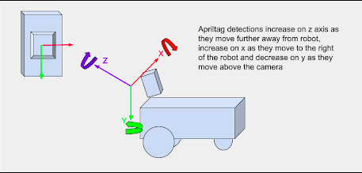

# Exercise 3 Report

## TL;DR

Text for tldr will go here

## Part 1
---
### Computer Vision

 

Below you can see a video of the duckiebot detecting the apriltags. When this first started working, it was incredibly cool to see!

**video here!**

 

**What does the apriltag library return to you for determining its position?**

The apriltag library returns an AprilTag object for us! This is incredibly helpful since we are able to use commands like `apriltag.corners` to help draw the bounding box of the image. 

 

**Which directions do the X, Y, Z values of your detection increase / decrease?**

<figcaption align = "center"><b>Fig.1: Diagram to find tick rotation</b></figcaption>

 

As stated in the above picture, apriltag detections will increase on the *Z* and *X* axis as they move in the positive direction. apriltag detections will decrease as they move in the negative direction on the *Y* axis. 

 

**What frame orientation does the apriltag use?**

<u>not sure about this question</u>

The frame orientation can be found using the right hand rule. Utilizing the RHR, we are able to see a frame orientation similar to Fig.1 

 

**Why are detections from far away prone to error?**

Detections from far away can be prone to error due to a few reasons:

- The angle of the camera: Since the camera is tilted down, some distortion can occur when trying to detect tags
- The field of view: With a wide field of view an image can look distorted when compared to a smaller FOV
- The physical camera: The physical camera equipped on the duckiebot is not the best quality. It also has a slight fisheye lens which can cause added distortion

 

**Why may you want to limit the rate of detections?**

Since our duckiebot is not equipped with very much onboard memory, it can get easily overloaded by trying to detect many objects in a small period of time. By limiting the number of detections, we can increase our operating efficeny and also speed up subsequent detections. 

 

## Part 2
---
### Lane Following

 

Below you can see a video of the duckiebot utilizing the PID controller and lane following <u>American</u> driver style.

**video here!**

 

Below you can see a video of the duckiebot utilizing the PID controller and lane following <u>English</u> driver style.

**video here!**

 

**What is the error for your PID controller?**

answer

 

**If your proportional controller did not work well alone, what could have caused this?**

answer

 

**Does the D term help your controller logic? Why or why not?**

answer

 

**(Optional) Why or why not was the I term useful for your robot?**

answer

 

## Part 3
---
### Localization using Sensor Fusion

 

Below you can see view from RViz as we do a lap around the track. The camera feed, odometry frame and static apriltag frame is shown.

<iframe width="560" height="315" src="https://www.youtube.com/embed/YbNmJU6vKUY" frameborder="0" allow="accelerometer; clipboard-write; encrypted-media; gyroscope; picture-in-picture; web-share" allowfullscreen></iframe>
<figcaption align = "center"><b>Vid.1: Video for part 2 demonstration</b></figcaption>

 

**Where did your odometry seem to drift the most? Why would that be?**

The most drift was seen when turning. The necessity for encoder precision is maximized in the turns since small errors can compound and cause large drift. 

 

**Did adding the landmarks make it easier to understand where and when the odometry
drifted?**

Adding the landmarks made it significantly easier! Being able to visualize where the robot is in real-time is very beneficial. 

 

**Show the generated transform tree graph, what is the root/parent frame?**

 <iframe src="assets/images_ex3/originalTransformTree.pdf" width="75%" height="500px"></iframe>
<figcaption align = "center"><b>Fig.1: Original Transform Tree</b></figcaption>

 

There are currently two root frames - the first being the “{robot_name}/WorldFrame” frame that we created for the odometry and apriltag locations. The second was the “{robot_name} footprint” frame that contained all of the components of the bot are children of. It made sense to set the parent of the footprint frame to be the odometry frame, since we then would be able to visualize all components of the robot relative to the apriltag locations.

 

**Move the wheels and make note of which join is moving. What type of joint is this?**

To determine this, first we set footprint's parent frame to be the odometry frame. For some time we tried to figure out how to connect the footprint of the bot to the odometry frame so the bot is placed where it perceived itself to be in the world. Using static transforms (similar to the apriltags) made this job possible. Plus, we use this same method further on! Being able to utilize all of this helped us to find that almost every joint type is fixed but the wheel joints are continuous.

 

**You may notice that the wheel frames rotate when you rotate the wheels, but the frames never move from the origin? Even if you launch your odometry node the duckiebot’s frames do not move. Why is that?**

This was due to the two root nodes. We could set RViz to show the footprint of the duckiebot OR show the WorldFrame with the odometry node. We need to connect the footprint to the odometry node for this to link properly.

 

**What should the translation and rotation be from the odometry child to robot parent frame? In what situation would you have to use something different?**

In this case, we want to use a translation of $(0,0,0)$ and a rotation of $(0,0,0)$. The odometry node shows precisely where the bot thinks it is, so no rotation or translation is needed. For example, we would need a translation or rotation if the odometry node was publishing the robot frame 90° off of expected.

 

**After creating this link generate a new transform tree graph. What is the new root/parent frame for your environment?**

The new root is just footprint. The key difference here is that the WorldFrame, apriltags, and odometry node are not appearing as a separate tree. We understand it to be that the “tf2_tools view_frames.py” script is hardcoded to assume the root is footprint, so even though footprint now has a parent odometry_node, it is not shown.

 

**Can a frame have two parents? What is your reasoning for this?**

No. The child frame needs to be positioned relative to the parent. If there are two parents that have two different positions, what does it mean to be $(+0.5, +0.5)$ transformed from both parents? This would give an inconclusive result or a bad coordinate. However, a parent can have multiple children; there’s no issue having multiple children reference a single parent’s location.

 

**Can an environment have more than one parent/root frame?**

It can, but it is highly recommended not to. Issue visualizing in RViz will occur as well as issues in testing and debugging the code.  

 

**Show the newly generated transform tree graph, what is the new root/parent frame?**

<iframe src="assets/images_ex3/newTransformTree.pdf" width="75%" height="500px"></iframe>
<figcaption align = "center"><b>Fig.1: New Transform Tree</b></figcaption>

 

The new parent frame shown on the transform tree graph is footprint - but in reality the root is “WorldFrame”. You can imagine just drawing a connection between “odometry” and “footprint” in **Enter figure number here!** - this is the true new tree.

 

Below you can see a video of the duckiebot moving around the world frame with all robot frames attached to the moving odometry frame. Apriltag detections are also shown in the camera feed and visualized in RViz.

**video here!**

 

**How far off are your detections from the static ground truth?**

answer

 

**What are two factors that could cause this error?**

1. The code to convert the 2d bounding box + depth to the 3d coordinate from the camera doesn’t account for distortion of the lens. 
2. Inaccuracies converting from the camera frame such as not accounting for camera being pointed just slightly down.

 

Below you can see a video of the duckiebot moving around the world using lane following. Our sensor fusion node attempts to teleport the robot if an apriltag is found and to use odometry if no apriltag is detected. Our goal is to finish as close to the start as possible. 

**Video here**

 

**Is this a perfect System?**

answer

 

**What are the causes for some of the errors?**

answer

 

**What other approaches could you use to improve localization?**

answer

 

## References
---
[Lab Manual](https://eclass.srv.ualberta.ca/pluginfile.php/9276727/mod_resource/content/3/Exercise%203.pdf)

[Classical Robotics Architectures using Duckietownown](https://docsduckietown.org/daffy/duckietown-classical-roboticsduckietown-classical-robotics-ready-tablet.pdf)

[Apriltag with Python](https://pyimagesearch.com/2020/11/02/apriltag-with-python/)

[dt-core Library](https://github.com/duckietown/dt-core)

[CMPUT 412 Cheat Sheet](https://docs.google.com/document/d/1bQfkR_tmwctFozEZlZkmojBZHkegscJPJVuw-IEXwI4/edit#)

[Duckietown Docs](https://docs.duckietown.org/daffy/)

