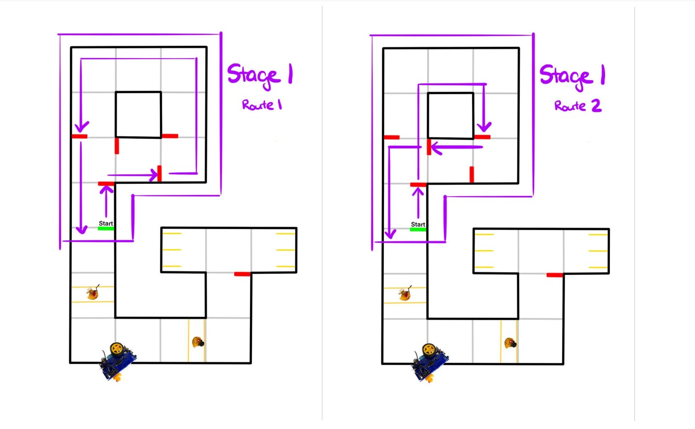
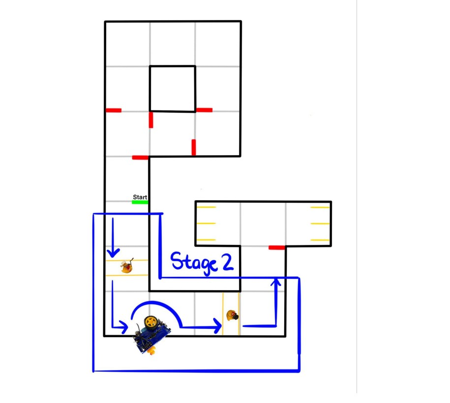
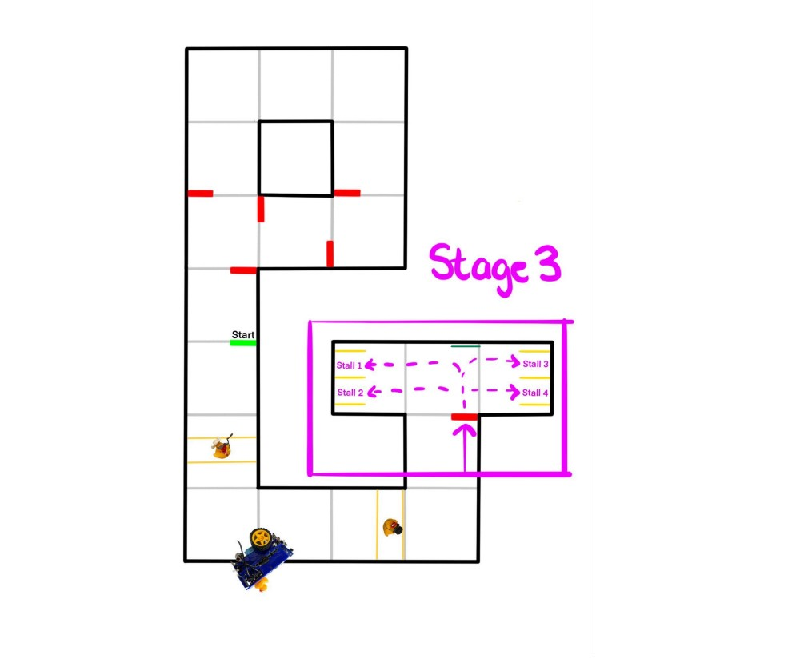

# Final Project

## TL;DR

Driver's Ed is over! Time to put our bot to the test and see if it can pass the driving exam! We ended up graduating with 105/120 points so safe to say that's a pass for our bot!

 

<iframe width="560" height="315" src="https://www.youtube.com/embed/hXwFgJ0_JLc" title="YouTube video player" frameborder="0" allow="accelerometer; autoplay; clipboard-write; encrypted-media; gyroscope; picture-in-picture; web-share" allowfullscreen></iframe>
<figcaption align = "center"><b>Vid.1: Traversing Duckietown</b></figcaption>

 

## Stage 1
---
### Apriltag Detection and Lane Following

 

For stage one our strategy composed of a five main steps:

1. Normal lane follow
2. Stop at a red line and turn off PID/lane follow
3. Determine what movement to make (straight, left, right)
4. Dead reckon the movement
5. Turn PID/lane follow back on

Our normal lane follow runs during almost all of the track, but we did have to do some fine tuning on it specific to the bot we were using. Since all duckiebots have their own quirks, we had to tune our PID to make sure it worked well for this project. 

Once we had the PID all tuned up, we had to decide how we wanted to stop. In the early stages of development, we were going to stop based on apriltags, however we would sometimes miss a detection which would cause us to blow through the intersection. We then pivoted to stopping based on red lines similar to previous labs, which was much more reliable.

Once we were at a stop, we were much more likely to detect an apriltag. Since the camera has a slow shutter speed, when moving, images can appear blurry or distorted which causes missed readings.Now we could interpret what route to take based on the first apriltag ($fig. 1$). Once we identified the apriltag ID, we were able to perform any of the three intersection actions: straight, left, or right. A big problem we ran into on this stage was double detections. If our bot detected the same apriltag $n$ times, it would execute the command $n$ times. To work around this we came up with up with a few ideas, but ultimately ended up using a timer to ignore any detections for a set amount of time (~6 seconds including stop time).

For our turns we decided that turning off the lane follow and dead reckoning through the intersection would be the best course of action. We had to do some detailed work trying to make the ticks of the wheel line up well and make the turns smooth which took some time to get right. Since we were cycling through three bots for testing due to battery life, we had to tweak the values often depending on the bot we were utilizing at the time. One idea we came up with after we completed the project was to have the parameters set themselves based on the name of the bot! Since we are able to find the name of the bot at compile time, we could then dynamically assign preset values like velocity PID parameters, or wheel ticks for turns.

Once most or all of the turn was completed according to the wheel ticks, we re-enabled our PID and it centered the bot in the lane to be ready for the next turn sequence.   

<figcaption align = "center"><b>Fig.1: Stage 1</b></figcaption>

 

## Stage 2
---
### Obstacle Avoidance

 

When we first got tasked with this final project, the group agreed that maneuvering around the broken down duckiebot (seen in $fig.2$) would be challenging and a large time sink. We decided to not attempt this part of the project which ended up being a good call for us since we got almost everything else working very well. 

For stopping at the cross walk, we took the same approach as stopping during stage one; stop at the coloured lines on the road. This time instead of colour masking for red, we were colour masking for the dark blue. This made implementation very easy since we had already wrote the code and just needed to tweak a few parameters.

Even though we didn't end up maneuvering around the broken bot, we did stop for it. When we created our color mask for the blue side walk, we meshed it with the same blue of the crosswalk. We also used the size of the contour to verify we were looking at a large blue object close to use which could only be the bot to make sure we stop.

Finally, for stopping while pe🦆strians (pedestrians) were crossing, we did almost the exact same thing again! We took an image of the ducks, color masked it, and while we saw that yellow in our FOV, we would not move. This worked well for us and we got stage two done fairly painlessly!

One problem we did run into was after implementing stage two and re-testing stage one. After implementation, we noticed some strange stopping behavior and realized our bot was seeing yellow during stage 1 where none was present, perhaps due to our HSV values. Instead of fine tuning our HSV over and over, we decided to sleep the control node for stage two for the duration of stage one (~30 seconds) which fixed our problem.

<figcaption align = "center"><b>Fig.2: Stage 2</b></figcaption>

 

## Stage 3
---
### The Parking Lot

 

In stage three we came up with a good approach since we knew the stall location wouldn't change between runs and the requested stall would be known at compile time. Once we entered the parking lot, we used the apriltag at the front to localize ourselves. If we did not detect the apriltag we would "creep" or spin around until we found it and could localize ourselves. Our bot would then drive forward a set distance depending on if we wanted to park in the close or far stalls ($fig. 3$). 

After we had met the correct distance, we take a series of miniature spins to centre the bot with the target april tag in the requested stall. Since dead reckoning can be inaccurate as well as very inconsistent without lots of painful tuning, this was a clever, robust way, to get us in the parking stall without touching the yellow lines. Once again, if we did not detect the stall apriltag, we would "creep" or spin around until we found it. We then used our PID to drive forward until we were sufficiently within the stall by measuring the distance to the stall apriltag. Once we were close enough, our bot would stop and shut down all nodes.

<figcaption align = "center"><b>Fig.3: Stage 3</b></figcaption>

 

## Wrapping Up...
---
### 🦆s Are Awesome!

 

Now with this course all wrapped up, I can really look back on it and say how fantastic it was. I learned so much about computer vision, machine learning, kinematics, and more. It's opened up doors for me that I wouldn't have thought about otherwise and so far has been the most interesting course I've taken during my time in computer engineering. Seeing this final project come to fruition really made all of those late night lab sessions during the semester so worth it.

Now I'm going to be working on creating a workshop to use the duckietown platform for hackathons, something I never would have done otherwise. Robotics is amazing and I can't wait to learn more about it.

Eric out. ⚡
